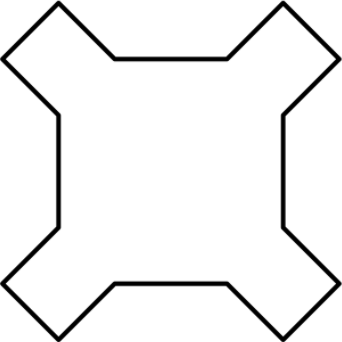
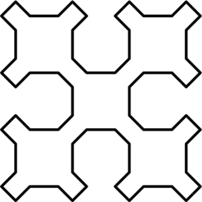
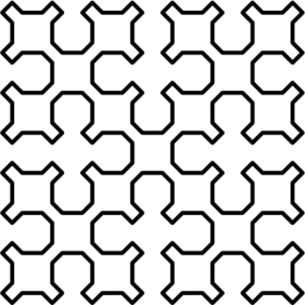
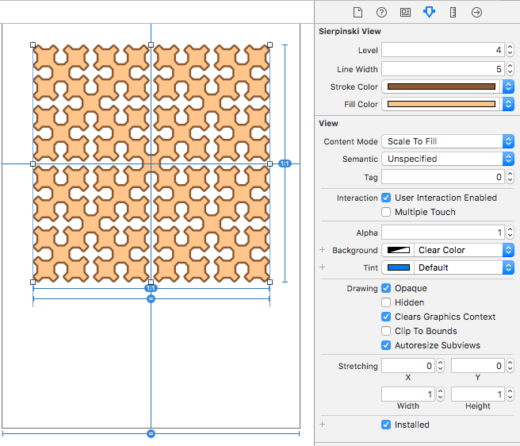

# Sierpiński curve
Generates a Sierpiński curve using a turtle mechanism in Swift.

## Levels

The level, also known as generation, determines the number of recursive steps that are generated.

|   |   |   |
|---|---|---|
| *Level 1* | *Level 2* | *Level 3* |


## Turtle
A turtle describes a relative cursor upon a Cartesian plane.[[1]](https://en.wikipedia.org/wiki/Turtle_graphics)

For this project a simple ```Turtle``` protocol is defined with the following interfaces:

```swift
func move(to location: CGPoint)
func move(by distance: CGFloat)
func rotate(clockwise angle: CGFloat)
func rotate(counterClockwise angle: CGFloat)
```

This greatly simplifies the drawing commands for fractals and also makes the Sierpiński curve generic, so it could be used for purposes other than drawing.

## IBDesignable
As a nice to have, the ```SierpinskiView``` is an IBDesignable with inspectables for the level, line width, stroke color and fill color.



## License

This project is available under the MIT license. See the LICENSE file for more info.